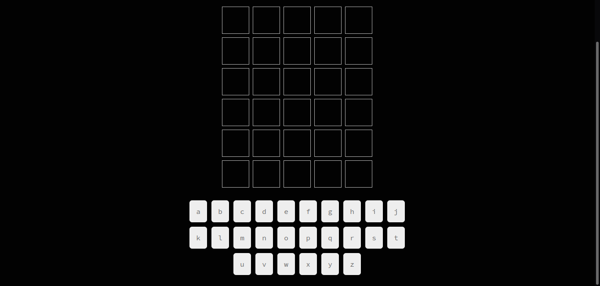

# WordIT

The project is a clone of the famous online game Wordle. It is built with ReactJS. The code contains complete documentation of important steps.

----------------------------------------------------------------------------------------------------

# Setup
If you want to build this project then fork this repository.
Then clone the repository on your local machine. For that you need to have git installed.
`git clone --followed by the url`

To run the application on your local machine you will have to run
`npm install`
and then run 
`npm start`

You will still not get the keypad though you can use your regular keyboard.To get the keypad
follow the steps:
- Open another terminal in the root folder
- Run the following command ` npx json-server  ./data/word-bank.json --port 3001 `

---

